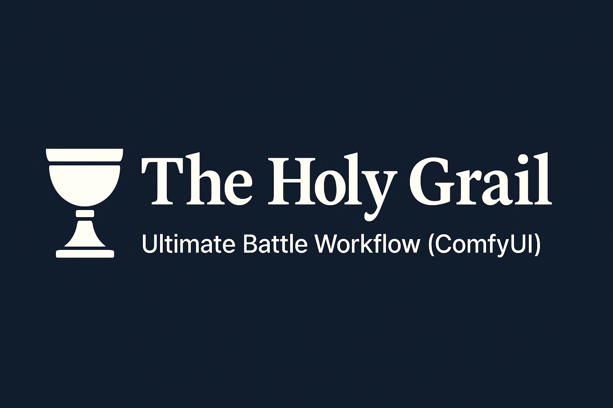

# The Holy Grail: Ultimate Battle Workflow (ComfyUI)



> **"From thought to frame — no limits, no filters. Just you and the rift."**
> **"Every spark in your mind becomes a story in this canvas."**

---

## ⚔️ What is The Holy Grail?

**The Holy Grail** is a modular, cinematic-grade **GIGA workflow** for ComfyUI, built for creators who demand **total control** over the look, feel, pose, style, and soul of every image.

This isn't just a prompt tool — it's a **vessel for pure imagination**, a system where **face reference, pose reference, emotion, atmosphere**, and **storytelling** merge into one creative stream.

If you've ever wished to take the exact image in your head and bring it into existence — this is how.

---

## 🧠 Workflow Preview


---

## 📦 What's Included?

* [`The_Holy_Grail.json`](./The%20Holy%20Grail.json) full GIGA workflow
* Ready-to-use LoRA stack and modular blocks
* Face reference (IPAdapter) + Pose reference (ControlNet)
* Conditioning, dual KSampler, detailer, and upscale
* [`Install Guide — The Holy Grail (ComfyUI Workflow)`](./Install%20Guide%20%E2%80%94%20The%20Holy%20Grail%20%28ComfyUI%20Workf...) for 1-click setup with Git

---

## 🚀 1-Click Install (Clone via Git)

```bash
git clone https://github.com/aabrur/the-holy-grail-ultimate-battle-workflow.git
```

Then simply open ComfyUI and load:

```
./The Holy Grail.json
```

---

## 💡 How to Use It

### 1. Load the Workflow

```
ComfyUI > Load > Custom Workflow > The_Holy_Grail.json
```

### 2. Choose Mode:

| Mode            | Action                                    |
| --------------- | ----------------------------------------- |
| With References | Use IPAdapter & ControlNet (image & pose) |
| No References   | Right-click > Bypass reference nodes      |

### 3. Prompt Setup:

```
Positive:
masterpiece, anime artstyle, cinematic lighting, ultra-detailed, dramatic battle scene, full body, elemental clash

Negative:
(worst quality:2), blurry, bad anatomy, watermark, extra limbs, distorted hands
```

### 4. Suggested Settings

* **Sampler:** DPM++ 2M Karras
* **Steps:** 30–40
* **CFG Scale:** 7.5–8.5
* **Resolution:** 1024x1536, 1152x768, or higher
* **Upscaler:** UltraSharp 2x–4x

---

## 🧩 Modular Nodes Breakdown

* ✅ Prompt Conditioning (text & style)
* ✅ IPAdapter (face control, optional)
* ✅ ControlNet (pose control, optional)
* ✅ Power LoRA Stack Loader (multiple at once)
* ✅ Dual KSampler for precision + depth
* ✅ Detailer & RestoreFace for clean output
* ✅ Final upscale & save

---

## 🔥 Sample Results

|  |  |
| ----------------------------------------- | ----------------------------------------- |
| Reference                                 | Result                                    |

---

## ✨ Why It's Different

This is more than a workflow — it’s your personal animation-grade scene generator.
Where others build prompts... **you direct a story**.
Every element you imagine — pose, facial structure, lighting angle, mood — can be defined, referenced, or bypassed.

> **Don’t just prompt AI art. Command it.**

---

## 👑 Created by

**Crimson Rift Studio**
“Every frame bleeds purpose.”
Follow: [@aabrur](https://github.com/aabrur)

---

## 📄 License & Usage

* Free to use, modify, remix
* Commercial use allowed with proper credit
* Redistribution allowed with attribution

---

## 🔗 Download & Start

💾 Load [`The_Holy_Grail.json`](./The%20Holy%20Grail.json) → Fire up ComfyUI → Build your own dimension ⚔️
